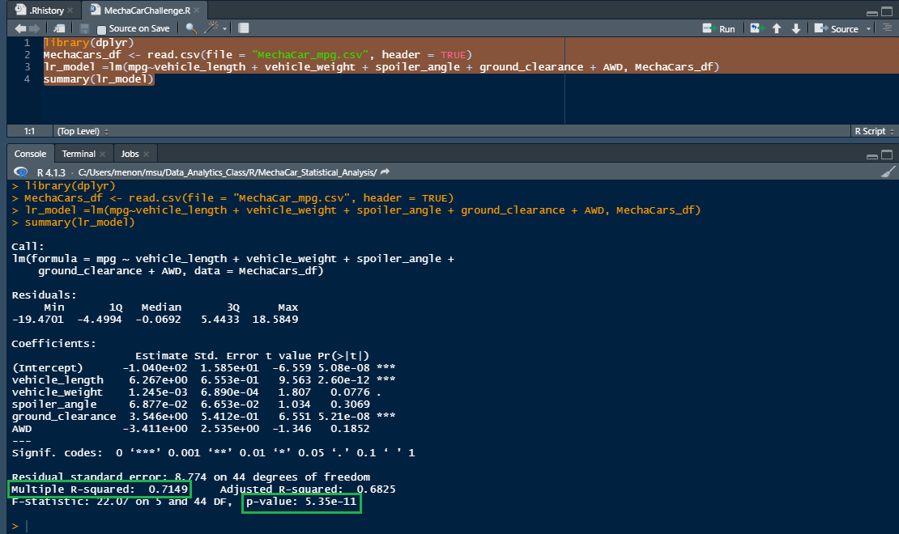
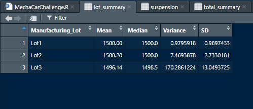
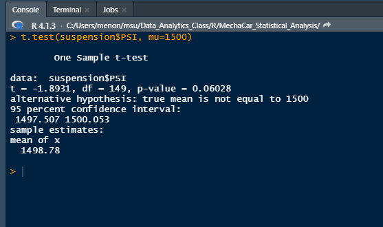
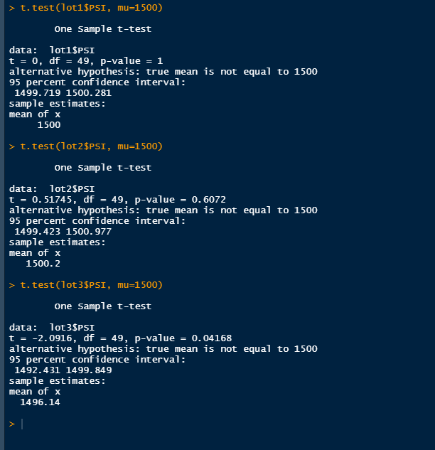

# MechaCar_Statistical_Analysis
### Overview

This project aims to review production data for a car company's newest prototype to look for insights that may help the manufacturing team resolve production troubles that they are currently experiencing.

## Multiple Linear Regression to Predict MPG

This analysis aims to identify which design specifications - ehicle length, vehicle weight, spoiler angle, drivetrain, and ground clearance - have statistically significant impacts on miles per gallon (mpg) for 50 prototype vehicles. 

### Linear Regression Analysis Summary
The r-squared value of this analysis is 0.7149 and the p-value result is 5.35e-11. 

These two results allow us to conclude the following:
- Two variables (vehicle length and ground clearance)  provide a non-random amount of variance to the mpg values (our dependent variable) in this data set.
- The slope of the linear model is NOT zero, as indicated by the p-squared value being much lower than the chosen significance level of 0.05. In other words, we can reject the null hypothesis and confidently say that these variables do have an effect on mpg.
- Given that the r-squared value is 0.7149, we can say that there is a 71% chance that this this linear model does effectively predict the mpg of MechaCars and that future data points will fit this model.

## Summary Statistics on Suspension Coils

In this dataset, the weight capacities of multiple suspension coils were tested to determine if the manufacturing process is consistent across production lots. 

### Results

The design specifications for the MechaCar suspension coils dictate that the variance of the suspension coils must not exceed 100 pounds per square inch (PSI). When considered as a whole, the data meet this specification: total variance for all manufacturing lots is only 62.3. 

When considered individually, though, the story changes. Lots 1 and 2 have very small variances (0.98 and 7.47, respectively), but Lot 3 calculations return a variance of 170.29. This is well past the 100 PSI cutoff. 

## T-Tests on Suspension Coils

This analysis aims to determine if all manufacturing lots and each lot individually are statistically different from the population mean of 1,500 pounds per square inch.

Using a one-sample t-test, we determined that the PSI across all manufacturing lots is NOT statistically different from the population mean of 1,500 PSI. The p-value is 0.06, which is only slightly above the 0.05 cutoff to reject the null hypothesis, but nonetheless requires us to accept it. 

Calculations performed on individual lots give a more granulated view of the situation. 
- Lot 1 has a p-value of 1, indicating that the observed sample is nearly identical to the population mean. In other words, we can strongly accept the null hypothesis.
- Lot 2 has a p-value of 0.06, requiring us to accept the null hypothesis as well.
- Lot 3 has a p-value of 0.04. Lot 3 is the only lot in the data set that shows sufficient variation between its data and the population mean such that we may reject the null hypothesis and say that the two means are not statistically similar. 

## Study Design: MechaCar vs Competition

While this analysis has been enlightening, a new car protype's performance must also be compared to vehicles being produced by other manufacturers, which will be its main competition in the market. 

There are myriad factors that we could compare and analyze, but a few that often top customers' lists of concerns are safety rating, horse power, price, and fuel effeciency. 

One additional statistical study that could be of interest is a multiple linear regression analysis testing the effect that horse power, price, and fuel effeciency have on safety ratings on cars already on the market. 

For this test, our null hypothesis would be that there is no correlation between the three independent variables (horse power, price, and fuel effeciency) and the dependent variable (safety rating). Our alternative hypothesis is that the independent variables do in fact have an effect on safety ratings.

We chose to use a multiple linear regression test for this analysis because it doesn't make sense that safety ratings would be determined by a single factor (simple linear regression). Additionally, "safe" cars are generally thought to be slower (less horse power and better fuel efficiency) and of mid-range price. 

In order to run this test, we would need to collect data on the four variables from a wide variety of manufacturers. One important caveat would be to decide on which safety rating will be used and only use data from cars that have received safety ratings using that metric. For example, if we decide to rate vehicles based on the US' National Highway Traffic Safety Administration's metrics, we shouldn't include data from cars produced in other countries that the NHTSA doesn't rate. 

